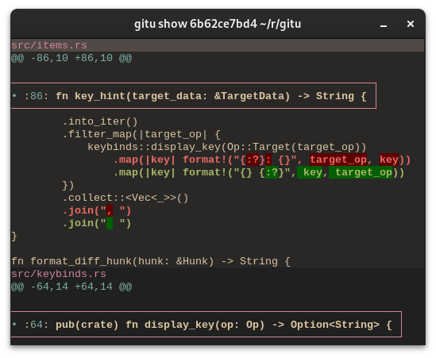
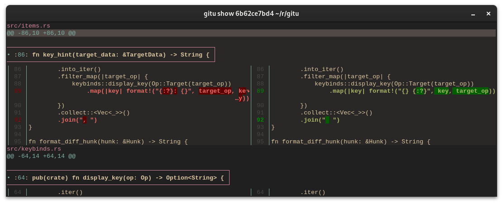

# Gitu
A git TUI heavily inspired by Magit.

## Dependencies
Requires `git` and [Delta](https://github.com/dandavison/delta) to be on your PATH.
[Delta](https://github.com/dandavison/delta) is used for formatting diff output.

## Install
### Using Cargo
Clone the repo and run:
`cargo install --path .`

## Hotkeys (WIP)
| Key     | Action                     |
| ------- | -------------------------- |
| q       | Quit                       |
| g       | Refresh items              |
| y       | Copy to clipboard          |
| TAB     | Toggle section             |
| j/k     | Move down/up               |
| C-d/C-u | Scroll half-page down/up   |
| l       | Go to log screen           |
| s       | Stage / Apply              |
| u       | Unstage / Apply in reverse |
| c       | git commit                 |
| f       | git fetch --all            |

## Features
- [ ] Staging / Unstaging (and apply / reverse)
  - [ ] Whole sections (Unstaged, Staged, Untracked)
  - [x] Files
  - [x] Hunks
  - [ ] Line-by-line
- [x] Toggle sections
- [x] Push / pull
- [x] Scrolling
- [x] Colorized / highlighted diffs
- [x] Open in editor
- [ ] Magit-like stateful hotkeys (c -> a to amend commit)
  - [ ] Command args e.g. --force on push
  - [ ] Command-palette to visualize hotkeys hotkeys
- [ ] Run arbitrary git command
- [ ] Line wrapping

## Configuration
Gitu utilizes [Delta](https://github.com/dandavison/delta) to format and highlight diffs if installed.
Configure Delta like you normally would, and the changes should be visible in Gitu.
You can even have diffs shown side-by-side

