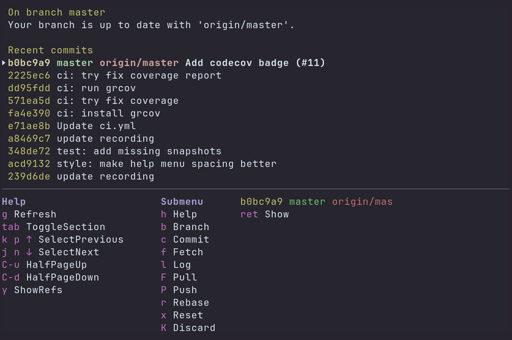

## It's Gitu! - A Git porcelain *outside* of Emacs

A terminal user interface for Git. Inspired by Magit, and launched straight from the terminal.

### Features
Gitu aims to implement many of the core features of Magit over time. 
It should be familiar to any previous Magit users.

A rough list of so-far supported features:
- File/Hunk/Line-level stage/unstage
- Show (view commits / open EDITOR at line)
- Show branches
- Branch:
  - checkout, checkout new
- Commit:
  - commit, amend, fixup
- Fetch:
  - all
- Log:
  - current, other
- Pull / Push:
  - remote
- Rebase:
  - abort, continue, autosquash, interactive
- Reset:
  - Soft, Mixed, Hard
- Stash:
  - save, pop, apply, drop

### Keybinds
A help-menu can be shown by pressing the `h` key.

### Configuration
The environment variables `GIT_EDITOR`, `VISUAL` or `EDITOR` (checked in this order) dictate which editor Gitu will open.

Configuration is also loaded from `~/.config/gitu/config.toml`,
you could copy the [default configuration](src/default_config.toml).
### Installing Gitu
Pick your package manager:

...or follow the install instructions: [Installing Gitu](docs/installing.md)

### Contributing
PRs are welcome!
This may help to get you started: [Development & Tooling](docs/dev-tooling.md)
