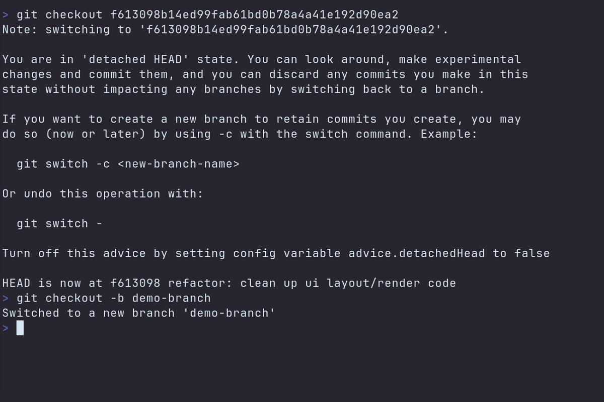

## It's Gitu! - A Git porcelain *outside* of Emacs

A terminal user interface for Git. Inspired by Magit, and launched straight from the terminal.

### Features
Gitu aims to implement many of the core features of Magit over time.
It should be familiar to any previous Magit users.\
Here's a list of so-far supported features:
- **Staging/Unstaging** _(file, hunk, line)_ 
- **Showing** _(view commits / open EDITOR at line)_
- **Branching** _(checkout, checkout new)_
- **Commiting** _(commit, amend, fixup)_
- **Fetching**
- **Logging** _(current, other)_
- **Pulling / Pushing** _(You may want to configure a [push.default](https://git-scm.com/docs/git-config/#Documentation/git-config.txt-pushdefault))_
- **Rebasing** _(elsewhere, abort, continue, autosquash, interactive)_
- **Resetting** _(soft, mixed, hard)_
- **Stashing** _(save, pop, apply, drop)_

### Keybinds
Keybinds try mimic Magit, while staying Vim-like.
A help-menu can be shown by pressing the `h` key.

### Configuration
The environment variables `GIT_EDITOR`, `VISUAL` or `EDITOR` (checked in this order) dictate which editor Gitu will open.

Configuration is also loaded from `~/.config/gitu/config.toml`,
you could copy the [default configuration](src/default_config.toml).
### Installing Gitu
Follow the install instructions: [Installing Gitu](docs/installing.md)\
Or install from your package manager:

### Contributing
PRs are welcome!
This may help to get you started: [Development & Tooling](docs/dev-tooling.md)
