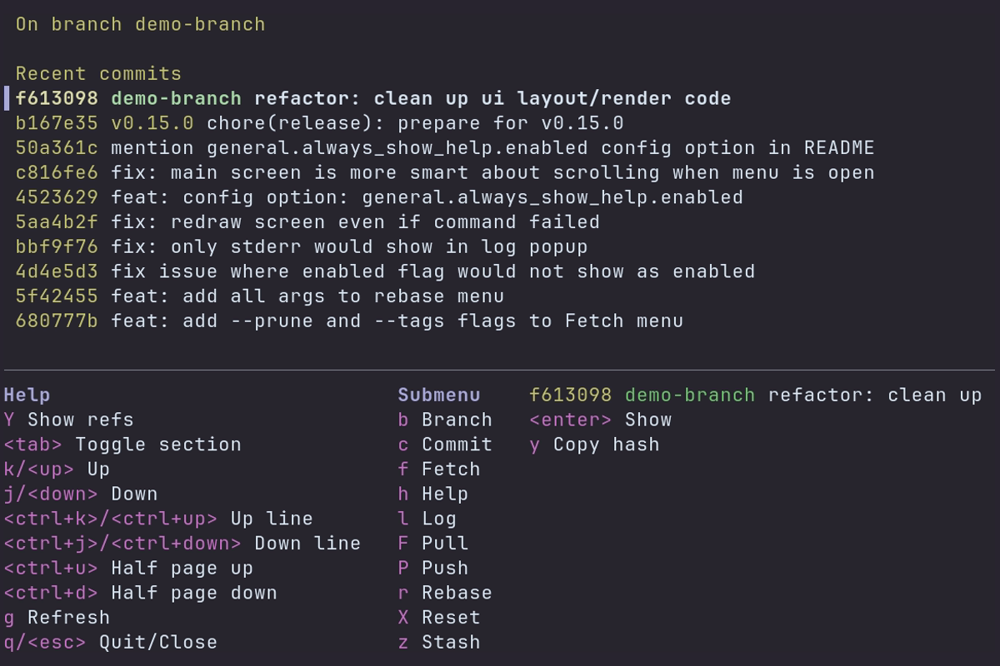

## It's Gitu! - A Git porcelain *outside* of Emacs

A terminal user interface for Git. Inspired by Magit, and launched straight from the terminal.

### Features
Gitu aims to implement many of the core features of Magit over time. 
It should be familiar to any previous Magit users.

A rough list of so-far supported features:
- File/Hunk-level stage/unstage
- Show (view commits / open EDITOR at line)
- Show branches
- Branch:
  - checkout
- Commit:
  - commit, amend, fixup
- Fetch:
  - all
- Log:
  - current
- Pull / Push:
  - remote
- Rebase:
  - abort, continue, autosquash, interactive

### Keybinds
A help-menu can be shown by pressing the `h` key.

### Install
#### Using Cargo
Clone the repo and run:
`cargo install --git https://github.com/altsem/gitu.git --locked`

### Development
#### Profiling
This project comes with pprof as a dev-dependency. You can run it with:
`cargo bench --bench show -- --profile-time 5`

A flamegraph would then be output to `target/criterion/show/profile/flamegraph.svg`
